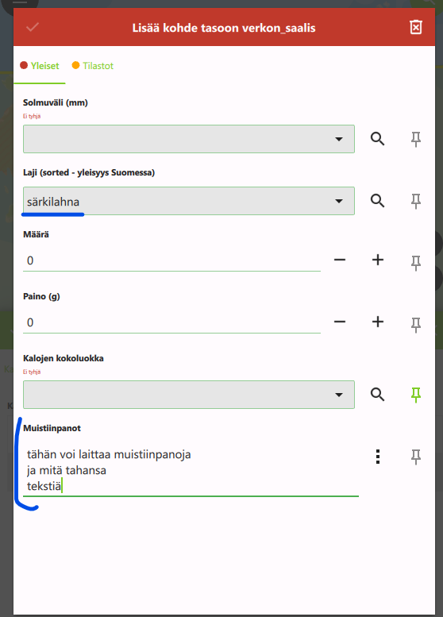
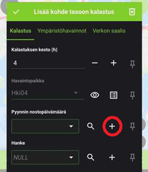
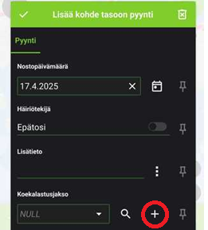

# Ennakkovalmistelut

- Asenna itsellesi tietokoneelle [QGISin viimeisin vakaa versio (LTR)](https://qgis.org/fi/site/forusers/download.html).
- Asenna mobiililaitteellesi [QField-sovellus sovelluskaupastasi](https://qfield.org/).

Lataa GeoPackage-tiedosto, joka sisältää projektitiedoston:

- [QGIS-projekti (viimeisin versio)](https://drive.google.com/uc?export=download&id=1QlG7vPjFnArE9oGc0RTJwcElKez63PT-) (Pyydä tarvittaessa tallennusoikeutta)

  **Päivitys 28.9.2026.** *(HUOM! Versio on tyhjä versio, jossa ei ole aiemmin tallennettua dataa)*

  **Muutokset:**

- Yleiset:

  - Päiväkohtainen saaliiden yhteenveto lomakkeen tuotu Havaintopaikka-tasolle QML kaaviona. 
  - Raskaat virtuaalikentät poistettu ja tämän myötä *Viimeisimmät kalastustapahtumat* -välilehti on poistettu
  - Relaationäkymänä nyt: 5 Ympäristöhavaintoa aiemman neljän sijaan (Nordic & Coastal)
  - Havaintopaikka listauksen välkkymisen ja kaatuilun korjattu. 
  - Visuaalinen tarkistus pituuskentille:
    - Pituusjakauman summasarakkeisiin on lisäty väri-ilmaisin: sarake näkyy punaisena, jos pituusjakauman summa ja ilmoitettu kokonaismäärä eivät täsmää, ja vihreänä, kun luvut ovat tasan.
  - Tilastojen laskenta pyynnöstä:
    - Tilastot-osion taustalaskenta ei pyöri enää automaattisesti muistin kuormittamiseksi, vaan laskenta käynnistetään *Tilastot*-välilehdeltä painikkeella "Haluatko laskea tilastot?".
  - Tyhjä verkko kenttä vaihdettu päälomakkeelle eli Nordic-kalastuksissa "Verkkopaikka"-tasolle ja Coastal-kalastuksissa "Kalastus"-tasolle. 
    - Kenttä poistuu näkyvistä, kun vähintään yksi verkon saalis syötetty. Jos Verkko merkitään tyhjäksi tulee pehmeä ehto/huomautus että selite on annettava.

- Coastal:
    - Pyynti taulu ja pyyntitiedot otettu pois kokonaan projektista palautteenne perusteella.
    - kalstuksiin viimeisimmän saaliin yhteenveto havaintopaikan näyttönimeksi. Tässä lyhyt video toiminnosta ([linkki](https://drive.google.com/file/d/1VZyIakRGD9rNYZQdzCUtCN3ay00FRAxn/view?usp=drive_link))
    - Havaintopaikan relaatiooonäkyvyydeksi vaihdettu 30 kohdetta 
    - Kalastus tasolla näkyy 15 viimeisintä saalista (Coastal)
    - Suolapitoisuus kentän tyyppi vaihdettu kokonaisluvusta desimaaliluvuksi desimaaliluvut

- Nordic:
    - Verkkopaikka tasolla näkyy nyt 15 viimeisintä saalista (Nordic)
    - Kalastus tasolla näkyy 15 verkkopaikkaa (Nordic)
    - Verkon saalis lomakkeella näkyy mikä havaintopaikka ja syvyys (Coastal) tai Verkkotunnustieto (Nordic) ([kuva](https://drive.google.com/file/d/1NDpzC0bIeKYbcSxEQ0Bhmm2tSqETvCBb/view?usp=drive_link))

- Suorityskykyä paranneltu vielä useissa kenttälomakkeissa

  **Päivitys 12.8.2025. Muutokset**

- Mahdollisuus syöttää yli 100 yksilön lukumääriä verkon_saalis tauluun. Maksimiarvoksi asetettu 9999.

- Yläpalkin värikoodit verkon saalista syötettäessä seuraavanlaiseksi: punainen, kun

  joku tiedoista solmuväli, laji, määrä ja paino puuttuu, oranssi, kune m. tiedot on

  syötetty, ja vihreä, kun laskettu määrä ja syötettyjen pituuksien määrä täsmäävät.

- Kun pituusjakaumia tallennettaessa laskettujen lukumäärä saavutetaan hyppäys otettu pois

- Kokoluokat muutettu seuraavasti: 1-7 cm, 8-35 cm, 36-80 cm ja 81-150 cm.

- Kaikilla lajeilla oletus kokoluokka 8-35 cm.

- Ympäristöhavaintojen kellonaika muutettu vastaamaan Suomen aikavyöhykettä

- Sekunnit otettu pois ajansyötöstä ympäristöhavainnoille

- **Päivitys 13.6.2025. Muutokset**

- Taustakartat ladattu nyt offline-tilaan. Tällöin taustakartat latautuvat myös ilman internet-yhteyttä.

- Kalastuksen keston maksimiarvo muutettu 12 tunnista 999h tuntiin.

- Pituusjakaumien syötön kaikkien arvojen (1-150cm) oletukseksi asetettu 0.

  **Päivitys 26.5.2025. Muutokset:**

- Lisätty loput havaintoalueet ja niiden paikat ([Github Issue 24](#0)).

- Lisätty mahdollisuus lisätä Ympäristöhavaintojen lämpötiloihin desimaalilukuja. Vaihdettu +-painikkeen askeleeksi 0.1

- Muutettu taustakarta *ei valittavissa* -muotoon, niin taustakarttan tiedot eivät vahingossa aukea, kun yrittää valita havaintopaikkaa.

- Verkon saaliin painon oletukseksi asetettu 0.

- Lisätty särkikalaristeymä "särkilahna" havaintolistaan ([Issue 12](https://github.com/GispoCoding/luke-koekalastus/issues/12)).

- Lisätty muistiinpanot *verkon_saalis* tauluun:

  

  **Päivitys 25.4.2025 Muutokset:**

- Traficomin Syvyyskartta-lisätty taustakartaksi.

- Verkon saaliin oletuskappalemääräksi asetettu 0.

- Syvyystiedot lisätty havaintopaikan yhteyteen. Oikea syvyystieto tulee automaattisesti tämän listaksen mukaan: <https://github.com/GispoCoding/luke-koekalastus/issues/16>. Syvyystietoa voi tarvittaessa vaihtaa alasvetovalikon avulla.

- Mahdollista lisätä "pyynti" suoraan havaintopaikan tiedoista:

  

- Mahdollista lisätä "koekalastusjakso" suoraan "pyynti"-tiedoista:

  

**Päivitys 16.4.2025 Muutokset:**

- Kalalajilistaus päivitetty saalismäärien mukaan, jos saalismäärätietoa ei ole saatavilla järjestyy aakkosjärjestyksen perusteella

- Verkon saalis tietojen "Tilastot"- välilehdelle lisätty keskipituus, joka päivittyy sitä mukaa kun määriä syötetään

- Hankelistaus lisätty "kalastus"- tauluun. Uusia hankkeita voi myös lisätä käsin.

- Havaintipaikka näkymäään lisätty edellinen kalastustapahtuma- välilehti, jossa näytetään tietoja edellisesta verkon saaliista. Tiedot näkyvät heti kun uudet tiedot on tallennettu.
