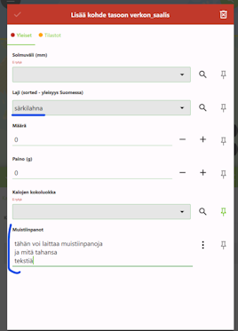

# Ennakkovalmistelut

-   Asenna itsellesi tietokoneelle [QGISin viimeisin vakaa versio (LTR)](https://qgis.org/fi/site/forusers/download.html).
-   Asenna mobiililaitteellesi [QField-sovellus sovelluskaupastasi](https://qfield.org/).

Lataa GeoPackage-tiedosto, joka sisältää projektitiedoston:

-   [QGIS-projekti (viimeisin versio)](https://drive.google.com/uc?export=download&id=1eDXXaWPuvdf8Gh_VLST9cFO6T7tb2N1N)

    **Päivitys 13.6.2025. Muutokset**

-   Taustakartat ladattu nyt offline-tilaan. Tällöin taustakartat latautuvat myös ilman internet-yhteyttä.

-   Kalastuksen keston maksimiarvo muutettu 12 tunnista 999h tuntiin.

-   Pituusjakaumien syötön kaikkien arvojen (1-150cm) oletukseksi asetettu 0.

    **Päivitys 26.5.2025. Muutokset:**

-   Lisätty loput havaintoalueet ja niiden paikat ([Github Issue 24](#0)).

-   Lisätty mahdollisuus lisätä Ympäristöhavaintojen lämpötiloihin desimaalilukuja. Vaihdettu +-painikkeen askeleeksi 0.1

-   Muutettu taustakarta *ei valittavissa* -muotoon, niin taustakarttan tiedot eivät vahingossa aukea, kun yrittää valita havaintopaikkaa.

-   Verkon saaliin painon oletukseksi asetettu 0.

-   Lisätty särkikalaristeymä "särkilahna" havaintolistaan ([Issue 12](https://github.com/GispoCoding/luke-koekalastus/issues/12)).

-   Lisätty muistiinpanot *verkon_saalis* tauluun:

    

    **Päivitys 25.4.2025 Muutokset:**

-   Traficomin Syvyyskartta-lisätty taustakartaksi.

-   Verkon saaliin oletuskappalemääräksi asetettu 0.

-   Syvyystiedot lisätty havaintopaikan yhteyteen. Oikea syvyystieto tulee automaattisesti tämän listaksen mukaan: <https://github.com/GispoCoding/luke-koekalastus/issues/16>. Syvyystietoa voi tarvittaessa vaihtaa alasvetovalikon avulla.

-   Mahdollista lisätä "pyynti" suoraan havaintopaikan tiedoista:

    

-   Mahdollista lisätä "koekalastusjakso" suoraan "pyynti"-tiedoista:

    

**Päivitys 16.4.2025 Muutokset:**

-   Kalalajilistaus päivitetty saalismäärien mukaan, jos saalismäärätietoa ei ole saatavilla järjestyy aakkosjärjestyksen perusteella

-   Verkon saalis tietojen "Tilastot"- välilehdelle lisätty keskipituus, joka päivittyy sitä mukaa kun määriä syötetään

-   Hankelistaus lisätty "kalastus"- tauluun. Uusia hankkeita voi myös lisätä käsin.

-   Havaintipaikka näkymäään lisätty edellinen kalastustapahtuma- välilehti, jossa näytetään tietoja edellisesta verkon saaliista. Tiedot näkyvät heti kun uudet tiedot on tallennettu.
