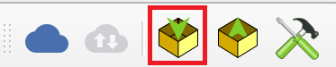

# Projektin vienti QFieldiin

## Projektin pakkaaminen

QGIS-projekti viedään QFieldiin kopioimalla tarvittavat tiedostot sisältävä kansio tietokoneelta mobiililaitteelle. Ensin pitää kuitenkin tehdä pakkaaminen QField Sync-lisäosan kautta. Avaa **Pakkaa QFieldiä varten** "Package for QField" työkalupalkista 

tai valikosta **Lisäosat-> QFieldSync-> Pakkaa QFieldiä varten**. Oletuskansiona, johon QField-projekti paketoidaan, on käyttäjän kotikansion alla olevan QField-kansion Export-alikansio (Esim. C:\Users\käyttäjänimi\QField\Export). Valitse tai luo tyhjä kansio sopivaan sijaintiin ja paina **Luo** (Create). Prosessin valmistuttua QGISin karttaikkunan ylälaidan palkkiin tulee ilmoitus onnistumisesta ja kansiosijainti, jota klikkaamalla pääsee ko. sijaintiin.

Voit katsoa esimerkkiä alla olevasta videosta. 

Jos et ole vielä kytkennyt omaa puhelinta tietokoneeseen esimerkiksi usb-kaapelilla, niin tee se. Käy sitten kopioimassa kaikki tiedostot (eli käytännössä em. kansio) jotka äsken loit lisäosan avulla ja siirrä ne puhelimeen sellaiseen sijaintiin, jonka  muistat. 

---
**Huom!**

 Jos tietokoneella ei pääse näkemään yhtään tiedostoja puhelimella, niin avaa puhelimen näyttö ja salli tarvittaessa yhteyden muodostaminen. Saattaa olla tarpeen myös tarkistaa puhelimen asetuksista, että tiedostojen siirto on sallittu, eikä pelkkä lataus.

## Projektin avaaminen Google drive sähköposti-linkin avaulla

1. Avaa sähköpostisovellus puhelimellasi.
2. Avaa sähköpostiisi tullut viesti, jossa ilmoitettaan että sinulle on jaettu kohde
3. Paina viestin "Avaa"- painiketta
  Ensimmäisellä kerralla voi olla että sinulta kysytään varmistuskoodia, joka lähetettään sähköpostiisi. Syötä tämä sähköpostiisi lähetetty varmistuskoodi niin pääset jatkamaan.
4. Lataa tiedosto "Lataa"-painikkeeen avulla.
5. Kun tiedosto on ladattu, paina "Avaa" ja valitse sovellukseksi QField.
6. QField sovellus aukeaa, jossa on projektitiedosto valmiiksi ladattuna.

<video width="640" height="360" controls>

<source src="img/qfield_projektin_avaus_spostista.mp4" type="video/mp4">

Your browser does not support the video tag. </video>

## Projektin avaaminen Google driven avaulla (Android)

1. Avaa Google drive- puhelimellasi 
2 Klikkaa GeoPackage -tiedostoa, joka on jaettu sinulle. (Yleensä näkyy heti aloitussivulla)
5. Valitse sovellukseksi QField.
6. QField sovellus aukeaa, jossa on projektitiedosto valmiiksi ladattuna.

<video width="640" height="360" controls>

<source src="img/qfield_projektin_avaus_drivesta.mp4" type="video/mp4">

Your browser does not support the video tag. </video>
---
## Tiedostojen siirto
Siirtäminen tapahtuu esimerkiksi raahaamalla edellä luotu tiedostokansio (videossa nimellä testiversio1), tai kopioimalla tiedostoina  kuten esimerkissä alla. Suosittelemme että luot uuden kansion jokaiselle projektille, jotta tiedostopolut ovat selkeitä.

