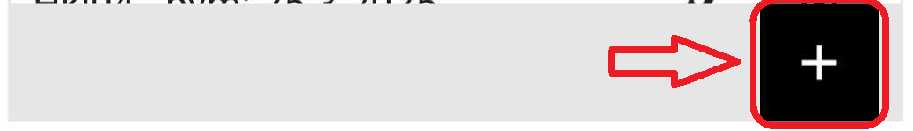

# Koekalastukseen tarkoitetun PoC-version käyttäminen

Kun edeltävien sivujen toimenpiteet on tehty ja on saatu GeoPackage auki QFieldissa, voidaan ruveta testaamaan koekalastukseen tarkoitetun PoC-version käyttöä tiedon keruuseen.

## Koekalastukseen liittyvien tietojen keruu

1.  Valitse kartalta havaintopiste

2.  Avaa kohteen tiedot

3.  Klikkaa muokkaustila päälle yläpalkin ikonista

    

4.  Syötä uusi kalastus tapahtuma + - painikkeesta

    

5.  Syötä kalastuksen kesto

6.  Valitse pyynnin nostopäivämäärä (ennalta syötetyistä tiedoista)

7.  Syötä ympäristöhavainnot ympäristöhavainnot välilehden + painikkeesta

8.  Syötä verkon saalis Verkon saalis välilehden + painikkeesta.

    1.  Anna solmuväli
    2.  Valitse laji
    3.  Syötä lukumäärä
    4.  Syötä yhteispaino
    5.  Valitse kalojen kokoluokka
    6.  Syötä kalojen määrät oikeisiin pituus-kenttiin
    7.  Jos haluat syöttää toisesta kokoluokasta myös määriä niin vaihda kokoluokka ja syötä määrät toisesta.
    8.  Jos kokonaislukumäärä ja syötettyjen pituus-kenttien lukumäärät ovat eri ilmoitetaan tästä käyttäjällä.
    9.  Kun Solmuvälin tiedot on syötetty painetaan vasemmasta yläkylmasta tarkistusmerkki
    10. Tämän jälkeen syötetään seuraavan solmuvälin tiedot samaan tapaan
    11. Kun kaikki solmuvälit syötetty painetaan vasemmasta yläkulmasta tarkistusmerkki-painiketta
    12. Tämän jälkeen painetaan vielä uudelleen tarkistusmerkkiä niin kaikki tiedot tallentuvat.

<video width="640" height="360" controls>

<source src="img/koekalastustietojen_lisays.mp4" type="video/mp4">

Your browser does not support the video tag. </video>

## Uuden havaintopaikan syöttäminen.

1.  Valitse tasot-valikosta havaintopaikka-taso

2.  Vaihda muokkaustilaan.

    

3.  Siirry kartalta uuden havaintopaikan kohtaan.

4.  Tallenna uusi havaintopaikka + -painikkeesta

    

5.  Anna havaintopaikan nimi

6.  Valitse havaintopaikan havaintoalue

7.  Paina lopuksi tarkistusmerkkiä, jolloin havainnot tallentuvat

    
<video width="640" height="360" controls>

<source src="img/havaintopaikan_lisays.mp4" type="video/mp4">

Your browser does not support the video tag. </video>

## Uuden koekalastusjakson lisäys

1.  Valitse tasot-valikosta koekalastusjakso-taso

2.  Vaihda muokkaustilaan.

    

3.  Tallenna uusi koekalastusjakso + -painikkeesta

    

4.  Anna koekalastusjakson nimi

5.  Anna alkupäivämäärä

6.  Anna loppupäivämäärä

7.  Syötä koekalastajat

8.  Valitse havaintopaikan havaintoalue

9.  Paina lopuksi tarkistusmerkkiä

    

## Uuden pyynti-tapahtuman lisäys

1.  Valitse pyynti-valikosta havaintopaikka-taso

2.  Vaihda muokkaustilaan.

    

3.  Tallenna uusi pyynti-tapahtuma + -painikkeesta

    

4.  Anna nostopäiväärä

5.  Jos häiriötekijöitä laita valinta päälle ja kirjoita avautuvaan kenttään häiriötekijän kuvaus.

6.  Valitse koekalastusjakso johon pyynti liittyy

7.  Paina lopuksi taas tarkistusmerkkiä

    

