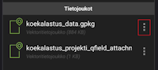
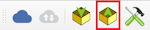

# Siirto QFieldistä QGISiin

## Vaihtoehto 1: Projektitiedoston siirto sähköpostin avulla

1.  Avaa projektin valikosta projektihakemisto

2.  Klikkaa *Tietojoukot* -kohdan .gpkg-tiedoston perässä olevaa kolmea pistettä

    

3.  Valitse *Lähetä ja* Valitse esimerkiksi sähköposti (voit halutessasi lähettää muunkin sähköisen viestimen välillä)

4.  Kirjoita sähköposti esim. itsellesi. ja lähetä viesti.

5.  Avaa sähköposti ja tallenna tiedosto tietokoneellesi

6.  Avaa alkuperäinen QGIS-projektisi (eli *ei* se mikä löytyi puhelimesta) tietokoneella.

    QFieldSync-lisäosan kautta valitse nyt **Synkronoi QFieldistä** (Synchronize from QField) tai vastaavasti työkalupalkista 

    Nyt valitset äsken puhelimesta kopioidun tiedoston. Nyt kentällä tallentamasi pisteet löytyvät QGISin projektista.

    Voit nyt muokata tietoja avaamalla attribuuttitaulukkoa. Voit myös lisätä uusia kohteita ja alueita tarvittaessa.

<video width="640" height="360" controls>

<source src="img/vienti_spostin_avulla.mp4" type="video/mp4">

</video>

## Vaihtoehto 2: Projektitiedoston siirto kaapelin avulla

Kun olet käynyt maastossa ja kerännyt tietoja, voit siirtää tiedot takaisin (yleensä) alkuperäiseen QGIS-projektiin.

Yhdistä puhelin tietokoneeseen ja kopioi koko projektin kansio puhelimesta sijainnista **drive:/Android/data/ch.opengis.qfield/files/Imported Projects** tietokoneelle, vaikkapa sijaintiin kotihakemisto/QField/import (oletuspolku QFieldSync-lisäosalle, esim. C:\Users\käyttäjänimi\\QField\\import).

Avaa alkuperäinen QGIS-projektisi (eli *ei* se mikä löytyi puhelimesta) tietokoneella.

QFieldSync-lisäosan kautta valitse nyt **Synkronoi QFieldistä** (Synchronize from QField) tai vastaavasti työkalupalkista 

Nyt valitset äsken puhelimesta kopioidun kansion. Nyt kentällä tallentamasi pisteet löytyvät QGISin projektista.

Voit nyt muokata tietoja avaamalla attribuuttitaulukkoa. Voit myös lisätä uusia kohteita ja alueita tarvittaessa.
